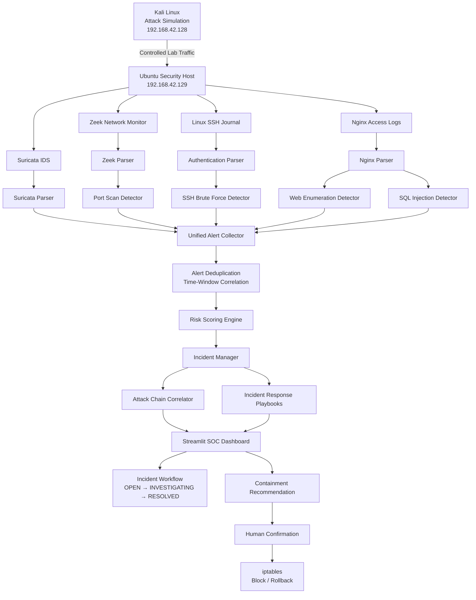

# System Architecture

The platform follows a layered security monitoring and incident response architecture.



## Processing Flow

```text
Security Telemetry
        ↓
Parsing
        ↓
Detection
        ↓
Alert Normalisation
        ↓
Time-Window Deduplication
        ↓
Risk Scoring
        ↓
Incident Generation
        ↓
Attack Chain Correlation
        ↓
Response Playbook
        ↓
SOC Dashboard
        ↓
Human-in-the-loop Containment
```

## Security Design

The dashboard operates without root privileges.

Security telemetry is accessed using least-privilege permissions:

```text
Suricata → Readable alert log
Zeek     → zeek group
SSH      → Journal access
Nginx    → adm group
```

Privileged firewall operations are not executed directly by the web application. Instead, the platform generates validated lab-only containment and rollback commands for analyst review.
